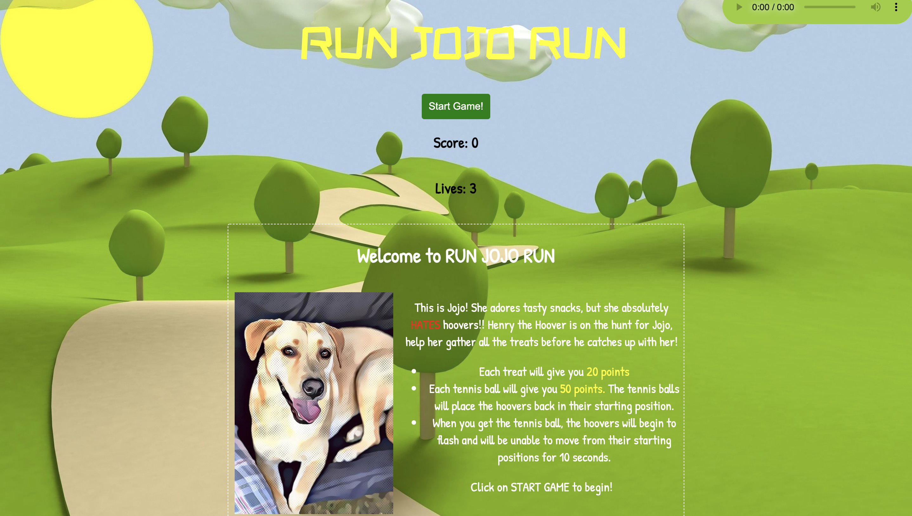
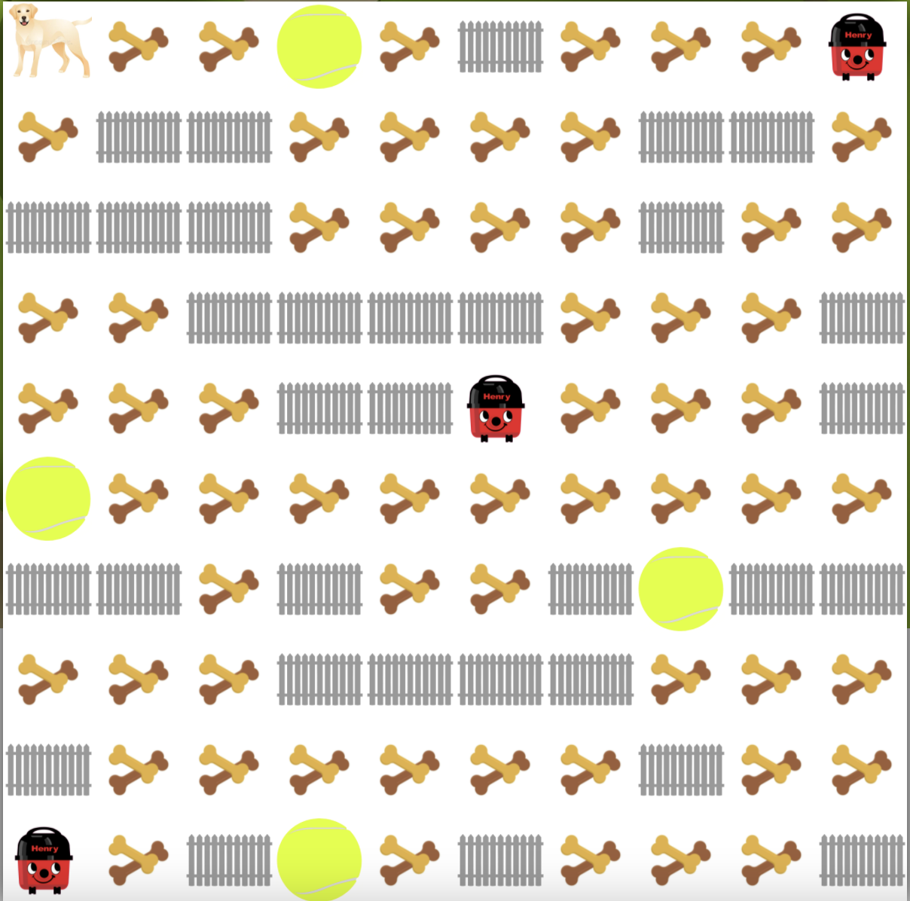

 

# Run Jojo Run - A PacMan Game 🎮

<!--- My first project at GA London's Software Engineering Immersive course was to design a grid-based game that would be rendered in the browser using HTML, CSS, and JavaScript. The project was to be completed individually in one week.

This game was deployed via GitHub pages and works best on a desktop with a keyboard. [Play the game here!](https://gayatrirajgor.github.io/SEI-Project-1/) 🐶 --->

## Table of Contents
|No. | Content                      | 
|----|------------------------------|
|1   | [Project Overview](#overview)|
|2   | [Project Brief](#brief)      |  
|3   | [Technologies Used](#tech)   |
|4   | [Concept](#concept)          |
|5   | [Approach](#approach)        |
|6   | [Bugs](#bugs)                |
|7   | [Wins & Challenges](#wins)   |
|8   | [Future Ideas](#future)      |

<a name="overview"></a>
## 1. Overview
My first project at GA London's Software Engineering Immersive course was to design a grid-based game that would be rendered in the browser using HTML, CSS, and JavaScript. The project was to be completed individually in one week.

This game was deployed via GitHub pages and works best on a desktop with a keyboard. [Play the game here!](https://gayatrirajgor.github.io/SEI-Project-1/) 🐶



<a name="brief"></a>
## 2. Brief 📃
* Render a game in the browser
* Include separate HTML, CSS, JavaScript files
* Design logic for winning & visually display which player won
* Use **KISS (Keep it Simple Stupid)** & **DRY (Don’t Repeat Yourself)** principles 
* Use JavaScript for DOM manipulation 
* Deploy your game online 
* Use semantic markup for HTML and CSS

<a name="tech"></a>
## 3. Technologies 💻
* HTML5
* CSS3
* JavaScript
* Git, GitHub & GitHub Pages
* Google Fonts
* Animate.style - CSS Animations

<a name="concept"></a>
## 4. Concept 🧐
I decided to make a Pac Man-themed game, using my dog, Jojo, as the influence for the theming and design. In this game, Henry the Hoover(s) is out to get Jojo, and Jojo must collect as many treats as she can while avoiding contact with the hoovers. If Jojo collects a tennis ball, the hoovers return to their original position for 10 seconds, allowing Jojo enough time to travel around and gather all of the treats.

<a name="approach"></a>
## 5. Approach ✏️
### Grid 
JavaScript and DOM manipulation were used to create the game’s grid. Using a for loop, I created new divs that were appended as children to the parent div.

```js
for (let i = 0; i < squareCount; i++){
      const square = document.createElement('div')
      square.classList.add('square')
      grid.appendChild(square)
      squares.push(square)
    }
```
To show the treats and fences on the grid, I built arrays of the positions and used forEach to add the class to those cells to determine which position the treats and fences will fill on the grid.

```js

const fencesPosition = [5, 11, 12, 17, 18, 20, 21, 22, 27, 32, 33, 34, 35, 39, 43, 44, 49, 60, 61, 63, 66, 68, 69, 73, 74, 75, 76, 80, 87, 92, 95, 99] 

function createFence(){
    fencesPosition.forEach((fence) => {
      squares[fence].classList.add(fenceClass)
      fences.push(fence) //pushes individual fence into an array of fences
    })
}
```

I placed an overlay over the grid location to hide it on the home page. This enabled me to block the player from playing the game before it began. When the page loads, the overlay function is called with the function `on()`, which then sets the overlay. The overlay is switched off when the player presses the start game button, using the `off()` method.

```js
 // * Overlay 
  function on(){ // to turn overlay on
    grid.classList.add('overlay')
    rules.classList.add('overlay')
    grid.style.display = 'none'
    rules.style.display = 'none'
  }
  
  function off(){ // to turn overlay off
    grid.classList.remove('overlay')
    rules.classList.remove('overlay')
    startScreen.classList.add('overlay')
    startScreen.style.display = 'none'
    grid.style.display = 'flex'
    rules.style.display = 'inline-block'
  }
```



### Player Movements
The player is able to move Jojo using the arrow keys, however they cannot enter a square where a fence is located. 

```javascript
const key = event.keyCode
    
    removeDog(dogCurrentPosition)
    
    //moving right
    if (key === 39 && !(squares[dogCurrentPosition + 1].classList.contains(fenceClass))){
      dogCurrentPosition++
    } else if (key === 37 && (!squares[dogCurrentPosition - 1].classList.contains(fenceClass))){ //moving left
      dogCurrentPosition--
    } else if (key === 38 && (dogCurrentPosition >= width) && (!squares[dogCurrentPosition - width].classList.contains(fenceClass))){ //moving up
      dogCurrentPosition -= width
    } else if (key === 40 && (dogCurrentPosition + width <= width * width - 1) && (!squares[dogCurrentPosition + width].classList.contains(fenceClass))){ //moving down
      dogCurrentPosition += width
    } else {
      console.log('INVALID KEY PRESSED')
    }
    
    addDog(dogCurrentPosition)
```

### Collisions 
When the player collides with the hoover, a life is lost and the function `checkForLives()` is invoked. The player is then sent back to the starting position. The `checkForLives()` function determines how many lives are remaining, and if the lives count equals zero, the game ends and an alert appears, informing the player of their score.

### Special Food
When the player enters a cell that contains a class of treats, 20 points are added to the score and the treat class is removed from that cell. I also added sound each time a treat had been eaten. 

```js
function removeTreat(){
    if (squares[dogCurrentPosition].classList.contains(treatClass)){
      squares[dogCurrentPosition].classList.remove(treatClass)
      treatCount -= 1
      console.log('TREAT COUNT:', treatCount)
      score += 20
      scoreCount.innerText = score
      munchSound.src = './sounds/munch.mp3'
      munchSound.play()
    }
  }
```
When the player enters a cell that contains a tennis ball, 50 points are added to the score and the hoovers are sent back to their starting positions. The hoovers then begin to flash and are held in their starting positions for 10 seconds; this was achieved using `setTimeout`. The code snippet below shows how I achieved this. 

```js
function removeBall(){
    if (squares[dogCurrentPosition].classList.contains(ballClass)){
      squares[dogCurrentPosition].classList.remove(ballClass)
      score += 50
      scoreCount.innerText = score
      ballFound(hoover1)
      ballFound(hoover2)
      ballFound(hoover3)
    }
}

function ballFound(hoover) {
    squares[hoover.currentPosition].classList.remove(hoover.class)
    hoover.currentPosition = hoover.startingPosition
    squares[hoover.currentPosition].classList.add(hoover.class)
    squares[hoover.currentPosition].classList.add(blinkClass)
    clearInterval(hoover.moveInterval)
    setTimeout(() => {
      hooverDirection(hoover)
      squares[hoover.currentPosition].classList.remove(blinkClass)
    }, 10000)
  }
```
<a name="bugs"></a>
## 6. Bugs 🛠️
* The hoovers can relocate to cells that have a fence, making it appear as if they have disappeared from the grid until they reach a cell that does not have a fence.

<a name="wins"></a>
## 7. Wins and Challenges 🏆
### Wins
* Being able to create this game after 3 weeks of learning.
* Successfully implementing CSS styling and animations.   

### Challenges
* Getting the hoovers to stay in their initial positions for an extended period of time was a significant challenge during this project. I overcome this difficulty by using `setTimeout` after doing some study and playing with the code.

<a name="future"></a>
## 8. Future Ideas 💭
* Mobile compatibility
* Adding a scoreboard
* Add difficult levels
